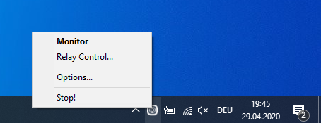

# The Onion Pack
This is The Onion Pack, a **Tor Relay Bundle** for Windows.
It allows you to install everything you need to run a Tor relay (or a Tor bridge) on your Windows computer system & offers you a smart interface to monitor and control your relay.

> **Statement of Independence**  
> This product is produced independently from the Tor(R) anonymity software and
carries no guarantee from [The Tor Project](www.torproject.org) about quality, suitability or anything
else.

## Installation
To install The Onion Pack on your Windows computer, download & run [TheOnionPack.exe](https://github.com/ralphwetzel/theonionpack/releases/latest) , its installation programm.

This installation program is going to perform a number of tasks:

* Locate, download & install the latest Tor *Windows Expert Bundle* from the official sources at [torproject.org](https://www.torproject.org/download/tor/).
* Download & install a version of *Embeddable Python* from the official sources at [python.org](https://www.python.org/downloads/windows/).
* Setup an appropriate Python environment.
* Download & install [The Onion Box](http://www.theonionbox.com) (Dashboard to monitor Tor node operations) from the [Python Package Index](https://pypi.org/project/theonionbox/) .

and finally

* Install The Onion Pack - a python script to control the Tor relay as well as The Onion Box.

## Additional Activities to be performed prior Operation
There's - usually - one additional activity necessary to finish the setup of The Onion Pack & your new personal Tor relay: You need to tell your router / firewall to forward at least one port to your local Windows system:

Tor - if operated as a relay or bridge - expects that clients can connect to its *ORPort*. If this port is not reachable from the voids of the internet, the relay will not announce it's presence - thus will not be of any use. Therefore you have to ensure that connections can be established to this *ORPort*.

The default value for the *ORPort* of any Tor relay is **9001**. You may alter this via *torrc*.

## Operation
When you run The Onion Pack, it launches your Tor relay - setup according to the configuration you defined - and The Onion Box. If both actions have been performed successfully, The Onion Pack puts an icon into the tray of your desktop.


This icon provides a context menu ... to monitor your Tor relay and to control it:





| Tray Menu Command | Action |
|---|---|
| **Monitor...** | Open The Onion Box, the dashboard to monitor your relay. Default (right click) action.
| Relay Control |
| Edit configuration file... | Opens *torrc*, the configuration file of your relay. You may edit & save this file to change the setup of your Tor relay.
| Show logfile... | Show the log messages of your Tor relay. This might be useful in case of trouble!
| Reload relay configuration...| If you've edited *torrc* to modify the configuration definition of your relay, you need to reload this configuration into the relay.
| Stop! | Terminate The Onion Pack

## First Steps
By intension the Tor instance **initially** installed by The Onion Pack is **not operating in Relay mode** - yet as a Tor client.  
If you deliberately decide to establish a relay, edit the configuration file: **Tray menu > Relay Control > Edit configuration file...**  
This will open an editor window - showing an empty file.

Prerequisite to become a relay is the definition of an [*ORPort*](https://2019.www.torproject.org/docs/tor-manual.html.en#ORPort) :
```
ORPort 9001
```
> Remember to define the port number in accordance to your port forwarding settings established at your router!

Additionally you should at least give a name to your relay and define the [*ContactInfo*](https://2019.www.torproject.org/docs/tor-manual.html.en#ContactInfo) parameter.

```
ORPort 9001
Nickname myRelay
ContactInfo mail at mymail dot com
```

As it is explicitely discouraged to run an Exit Relay on any computer system at home, you should - equally explicit - express your request to disable the exit functionality:

```
ORPort 9001
Nickname myRelay
ContactInfo mail at mymail dot com
ExitRelay 0
```

> Please make yourself familiar with the official documentation at [torproject.org](www.torproject.org), especially the [Tor Manual](https://2019.www.torproject.org/docs/tor-manual.html.en), to understand the capabilities of a Tor Relay and the meaning of all the configuration parameters!

You may & should define further configuration parameters ... and if done, save the modified *torrc*.

To enable this configuration, you need to tell your Tor node to reload it's configuration file: **Tray menu > Relay Control > Reload relay configuration**

Afterwards you may either check the logfile of your relay ( **Tray menu > Relay control > Show logfile...** ) or open the dashboard to monitor your relay: **Tray menu > Monitor...**

Have fun!


## Thank you
I'd like to express my humble respect to @jordanrussel and @martjinlaan for their dedication to [Inno Setup](http://www.jrsoftware.org/isinfo.php). This is an amazing piece of software providing endless opportunities to create powerfull installers. Thanks a lot for your efforts to maintain this gem in code over years, offering it's brilliant capabilities to the community.